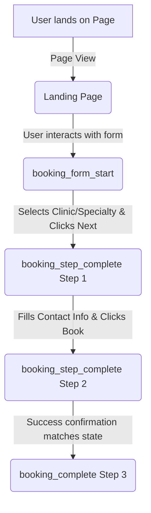

# Task 1 Solution: Google Tag Manager & Google Analytics 4 Implementation Schema

This document outlines a professional web analytics and tag management architecture designed for **OrthoNow**, a chain of 9 orthopedic clinics. It is structured to serve as an enterprise-grade reference for senior developers, marketing stakeholders, and analytics engineers.

---

## Section 1: Complete GTM Event Schema

This event schema covers default and custom tracking required to measure OrthoNow's site interactions, diagnose UI friction, and build conversion audiences.

| Event Name | Trigger Type | Event Description | Key Parameters (minimum 3) | GA4 Report / Audience | Business Purpose |
| :--- | :--- | :--- | :--- | :--- | :--- |
| `booking_form_start` | Custom Event | Fires when a user interacts with the first field in the booking form. | `form_id` (string)<br>`form_name` (string)<br>`form_step_number` (integer) | Funnel Exploration / **Audience**: *Active Form Starters* | Measures top-of-funnel initiation and form interaction engagement. |
| `booking_step_complete` | Custom Event | Fires upon successful validation and submission of steps 1 and 2 in the booking funnel. | `form_id` (string)<br>`step_number` (integer)<br>`step_name` (string)<br>`clinic_location` (string)<br>`specialty` (string) | Funnel Exploration / **Audience**: *Mid-Funnel Leads* | Pinpoints drop-off locations within the multi-step booking process. |
| `booking_complete` | Custom Event | Fires upon final confirmation and generation of a booking confirmation ID. | `form_id` (string)<br>`booking_id` (string - non-PII)<br>`clinic_location` (string)<br>`specialty` (string)<br>`appointment_lead_type` (string) | Conversions (Key Events) / **Audience**: *Booked Patients* | Primary conversion event measuring acquired appointments and marketing ROI. |
| `form_error` | Custom Event | Fires when form validation fails upon step submission. | `form_id` (string)<br>`step_number` (integer)<br>`error_field` (string)<br>`error_message` (string) | Event Reports / **Audience**: *High Friction Users* | Identifies user experience (UX) bottlenecks and validation bugs. |
| `cta_click` | Link Click | Fires when a user clicks on "Call Now" buttons or the WhatsApp floating chat widget. | `cta_type` (string)<br>`click_url` (string)<br>`page_path` (string)<br>`clinic_location` (string) | Engagement Reports / **Audience**: *Direct Contacts* | Measures direct-contact actions that bypass the booking funnel. |
| `guide_form_submit` | Custom Event | Fires when the gated "Download Patient Guide" form is submitted. | `form_id` (string)<br>`form_name` (string)<br>`guide_name` (string) | Lead Reports / **Audience**: *Educational Leads* | Evaluates mid-funnel content marketing effectiveness. |
| `clinic_page_view` | Page View | Fires when a user loads a clinic-specific location page (9 clinic pages). | `clinic_name` (string)<br>`clinic_city` (string)<br>`page_path` (string) | Custom Regional Performance / **Audience**: *Clinic Page Viewers* | Tracks interest and search traffic distribution across clinic locations. |
| `blog_scroll_depth` | Scroll Depth | Fires when a user scrolls to 50%, 75%, or 90% vertical depth on blog posts. | `article_title` (string)<br>`article_category` (string)<br>`percent_scrolled` (integer)<br>`time_on_page` (integer) | Engagement / Pages and Screens / **Audience**: *Engaged Readers* | Measures reading depth and content quality of educational blog articles. |

---

## Section 2: Booking Funnel Tracking Design

### The Core Martech Challenge (Interviewer Filter)
Multi-step forms typically update their state on the client side without triggering browser page reloads or updating URLs. **GTM cannot natively listen to these step transitions out of the box.** 
If GTM is configured to listen to generic button clicks (e.g., clicking a "Next" button), it will trigger false positives when a user clicks "Next" but fails form validation (e.g., leaving a required phone number field blank). 

Therefore, **the front-end developer must trigger explicit `window.dataLayer.push()` events**. This pushes structured JSON data only when a step has successfully passed client-side validation and the form is transitioning to the next step.

### Step-by-Step Funnel Mechanics



#### Step 1: Location & Specialty Selection
*   **When GTM Fires**: Instantly when the user selects a clinic location and specialty, passes step-1 validation, and clicks the button to proceed to Step 2.
*   **Custom Event Trigger**: Custom Event Trigger configured to fire on event name `booking_step_complete` where `step_number` equals `1`.
*   **dataLayer Event Pushed**: `booking_step_complete` (containing Step 1 details).
*   **GA4 Event Created**: `booking_step_complete` mapping `step_number`, `step_name`, `clinic_location`, and `specialty` as custom parameters.
*   **Marketer Drop-off Identification**: The percentage drop-off between `booking_form_start` and Step 1 completion indicates whether users are struggling to find their location/specialty or abandoning the page due to options layout.

#### Step 2: Contact Information Input
*   **When GTM Fires**: Instantly when the user fills in their contact details (Name, Phone) and preferred date, successfully passes step-2 validation, and clicks "Confirm Booking".
*   **Custom Event Trigger**: Custom Event Trigger configured to fire on event name `booking_step_complete` where `step_number` equals `2`.
*   **dataLayer Event Pushed**: `booking_step_complete` (containing Step 2 details, omitting all PII).
*   **GA4 Event Created**: `booking_step_complete` mapping `step_number`, `step_name`, `preferred_day_of_week`, `preferred_time_slot`, and `preferred_date_offset_days`.
*   **Marketer Drop-off Identification**: This is the highest-friction step. High drop-off here usually indicates privacy concerns (entering phone number) or friction with date selection.

#### Step 3: Booking Confirmation
*   **When GTM Fires**: When the back-end returns a successful response confirming the appointment, and the site displays the "Thank You" checkmark or screen.
*   **Custom Event Trigger**: Custom Event Trigger configured to fire on event name `booking_complete`.
*   **dataLayer Event Pushed**: `booking_complete` (containing transaction details).
*   **GA4 Event Created**: `booking_complete` mapping `booking_id`, `clinic_location`, `specialty`, and `appointment_lead_type`.
*   **Marketer Drop-off Identification**: Drop-off between Step 2 and Step 3 represents technical issues (API timeouts, payment/gateway failures, server errors) or late-stage user drop-off.

---

### Developer Briefing: Multi-Step dataLayer Push Implementation

#### Target Audience: Front-End / WordPress Engineers
**Objective**: Implement custom `window.dataLayer.push()` calls on the clinic booking form state machine to track step progression.

**Guidelines for Developer Team**:
1.  **Placement**: Call the push functions inside your form's step-transition event handlers *immediately after* client-side validation succeeds, but *before* you visually transition the UI.
2.  **No PII Policy**: **Do not send user names, email addresses, or phone numbers to the dataLayer.** We only send validation success flags and anonymous business variables.
3.  **Data Layer Initialization**: Ensure `window.dataLayer = window.dataLayer || [];` is initialized before making any pushes.

---

## Section 3: Production-Ready window.dataLayer.push() JSON

Here is the exact JavaScript code to be integrated directly into the front-end code.

### Step 1 Complete (Location & Specialty Selected)
```javascript
window.dataLayer = window.dataLayer || [];
window.dataLayer.push({
  'event': 'booking_step_complete',
  'form_id': 'clinic_appointment_booking_form',
  'form_name': 'OrthoNow 3-Step Appointment Booking',
  'step_number': 1,
  'step_name': 'location_specialty_selected',
  'clinic_location': 'Bengaluru - Indiranagar',
  'specialty': 'Orthopaedics - Knee Specialist'
});
```

### Step 2 Complete (Contact Info & Preferred Date Entered)
*Note: To comply with Google's PII policies and HIPAA regulations, patient names and phone numbers are excluded. In their place, boolean flags (`has_name_entered` and `has_phone_entered`) confirm validation state, while `preferred_date_offset_days` captures lead time anonymously.*
```javascript
window.dataLayer = window.dataLayer || [];
window.dataLayer.push({
  'event': 'booking_step_complete',
  'form_id': 'clinic_appointment_booking_form',
  'form_name': 'OrthoNow 3-Step Appointment Booking',
  'step_number': 2,
  'step_name': 'contact_info_entered',
  'clinic_location': 'Bengaluru - Indiranagar', // Persisted from step 1 for session consistency
  'specialty': 'Orthopaedics - Knee Specialist', // Persisted from step 1 for session consistency
  'has_name_entered': true,
  'has_phone_entered': true,
  'preferred_date_offset_days': 5, // Days between booking date and preferred appointment date
  'preferred_day_of_week': 'Wednesday',
  'preferred_time_slot': 'Morning (9 AM - 12 PM)'
});
```

### Step 3 Complete (Success / Booking Confirmed)
```javascript
window.dataLayer = window.dataLayer || [];
window.dataLayer.push({
  'event': 'booking_complete',
  'form_id': 'clinic_appointment_booking_form',
  'form_name': 'OrthoNow 3-Step Appointment Booking',
  'step_number': 3,
  'step_name': 'booking_confirmed',
  'booking_id': 'ON-2026-0702-AB892', // Anonymized unique transaction ID
  'clinic_location': 'Bengaluru - Indiranagar',
  'specialty': 'Orthopaedics - Knee Specialist',
  'appointment_lead_type': 'First Consultation',
  'user_engagement_status': 'New Patient'
});
```

---

## Section 4: GTM Implementation Architecture

To ingest these dataLayer pushes and pass them cleanly to GA4, we configure GTM with the following Variables, Triggers, and Tags.

### 1. Required Variables (GTM Data Layer Variables)
We must extract properties from the pushed objects to send them as Custom Dimensions in GA4.

*   `dlv - form_id`: Configured to read `form_id`.
*   `dlv - form_name`: Configured to read `form_name`.
*   `dlv - step_number`: Configured to read `step_number`.
*   `dlv - step_name`: Configured to read `step_name`.
*   `dlv - clinic_location`: Configured to read `clinic_location`.
*   `dlv - specialty`: Configured to read `specialty`.
*   `dlv - booking_id`: Configured to read `booking_id`.
*   `dlv - preferred_date_offset_days`: Configured to read `preferred_date_offset_days`.
*   `dlv - preferred_day_of_week`: Configured to read `preferred_day_of_week`.
*   `dlv - preferred_time_slot`: Configured to read `preferred_time_slot`.
*   `dlv - appointment_lead_type`: Configured to read `appointment_lead_type`.

### 2. Required Triggers
*   **Trigger 1**: Custom Event - `booking_form_start`
    *   Event Name: `booking_form_start`
*   **Trigger 2**: Custom Event - `booking_step_complete`
    *   Event Name: `booking_step_complete`
*   **Trigger 3**: Custom Event - `booking_complete`
    *   Event Name: `booking_complete`
*   **Trigger 4**: Link Click - `CTA Click - Call & WhatsApp`
    *   Click URL matches regex: `^(tel:|https://wa\.me/|https://api\.whatsapp\.com/)`

### 3. GA4 Event Tags
*   **Tag 1: GA4 - Google Tag**
    *   Fires on: Initialization (All Pages)
    *   Sends default configuration and sets pageview measurements.
*   **Tag 2: GA4 Event - booking_form_start**
    *   Fires on: Custom Event `booking_form_start`
    *   Event Name: `form_start`
    *   Parameters: `form_id` (`{{dlv - form_id}}`), `form_name` (`{{dlv - form_name}}`)
*   **Tag 3: GA4 Event - booking_step_complete**
    *   Fires on: Custom Event `booking_step_complete`
    *   Event Name: `booking_step_complete`
    *   Parameters:
        *   `form_id` = `{{dlv - form_id}}`
        *   `step_number` = `{{dlv - step_number}}`
        *   `step_name` = `{{dlv - step_name}}`
        *   `clinic_location` = `{{dlv - clinic_location}}`
        *   `specialty` = `{{dlv - specialty}}`
        *   `preferred_date_offset_days` = `{{dlv - preferred_date_offset_days}}`
        *   `preferred_day_of_week` = `{{dlv - preferred_day_of_week}}`
        *   `preferred_time_slot` = `{{dlv - preferred_time_slot}}`
*   **Tag 4: GA4 Event - booking_complete**
    *   Fires on: Custom Event `booking_complete`
    *   Event Name: `booking_complete`
    *   Parameters:
        *   `form_id` = `{{dlv - form_id}}`
        *   `booking_id` = `{{dlv - booking_id}}`
        *   `clinic_location` = `{{dlv - clinic_location}}`
        *   `specialty` = `{{dlv - specialty}}`
        *   `appointment_lead_type` = `{{dlv - appointment_lead_type}}`

### 4. Conversion Configurations
*   **Mark as Key Event (Conversion) in GA4**:
    *   `booking_complete`: This is the primary business conversion. It signifies a user successfully completing the reservation lifecycle.
*   **Do NOT Mark as Conversions**:
    *   `booking_form_start`, `booking_step_complete` (Steps 1 & 2), `form_error`, `blog_scroll_depth`.
    *   *Justification*: Marking mid-funnel events or micro-interactions as conversions dilutes data quality. If automated bidding models (like Google Ads Smart Bidding) optimize for mid-funnel micro-conversions, they will target users who click and start forms but have no intention of submitting them, leading to inflated conversion figures and wasted ad spend.

---

## Section 5: GA4 Funnel Exploration Configuration

A custom **Funnel Exploration** report allows marketing teams to isolate exact funnel leakages.

### Funnel Steps Configuration in GA4
In the GA4 Exploration Workspace, create a new Funnel Exploration and configure the steps exactly as follows:

| Step Number | Step Name | GA4 Dimension / Event Rule | Parameter Filters |
| :--- | :--- | :--- | :--- |
| **1** | **Landing Page** | `page_view` (Default Page View) | Page Path exactly matches `/book-consultation-landing` |
| **2** | **Form Started** | `form_start` (Custom Event) | `form_name` equals `OrthoNow 3-Step Appointment Booking` |
| **3** | **Step 1 Complete** | `booking_step_complete` (Custom Event) | `step_number` equals `1` |
| **4** | **Step 2 Complete** | `booking_step_complete` (Custom Event) | `step_number` equals `2` |
| **5** | **Booking Completed** | `booking_complete` (Custom Event) | *None (Fires on completion)* |

*   **Funnel Type**: **Closed Funnel**. This ensures that users are only counted if they follow the progression sequentially starting from the landing page. Users who arrive at Step 2 directly (e.g., via browser reload tricks or saved sessions) do not artificially skew intermediate rates.

### How GA4 Calculates Abandonment
GA4 computes abandonment rate at each step using this formula:

$$\text{Abandonment Rate} = \left( 1 - \frac{\text{Users completing Step } N+1}{\text{Users completing Step } N} \right) \times 100$$

*   **Example**: If $1,000$ users trigger Step 1 Complete (Step 3), and $400$ users trigger Step 2 Complete (Step 4), the abandonment rate for Step 3 is:
    $$\text{Abandonment Rate} = \left( 1 - \frac{400}{1000} \right) \times 100 = 60\%$$
*   **Marketers' Action Plan**: Marketers analyze this metric to find the largest percentage drop. For instance, if Step 3 -> Step 4 drops by 70% while Step 2 -> Step 3 only drops by 20%, it alerts the team that the contact-info page (Step 2) is a massive friction point, justifying A/B testing a simpler form design or removing non-critical inputs.

---

## Section 6: Google Ads Conversion Strategy

For Google Ads campaign optimization, **only import the `booking_complete` event as a Primary Conversion action.**

### Strategic & Business Justification

1.  **Eliminating Algorithm Noise (Smart Bidding Integrity)**:
    Google Ads Smart Bidding (Target CPA, Maximize Conversions) uses machine learning to find users similar to those who converted. If you import soft conversions (such as "Step 1 Complete" or "WhatsApp Click") as primary optimization goals, the algorithm optimizes for high-volume, low-friction clicks. A user clicking a WhatsApp icon has a high chance of dropping off without ever booking. Optimizing for clicks results in ad spend shifting toward casual browsers instead of high-value clinic appointments.
2.  **High-Value Medical Lead Quality**:
    In healthcare marketing, orthopedic treatments (e.g., knee surgery, spine treatments) are high-value, high-consideration procedures. The cost-per-acquisition (CPA) is high, making traffic quality critical. Optimizing strictly for `booking_complete` forces Google Ads to spend budget only on prospects whose behavior results in a scheduled consultation, securing the highest possible patient lead quality.
3.  **Clean Attribution and ROI Tracking**:
    By focusing on `booking_complete`, marketing teams can calculate direct return-on-ad-spend (ROAS). If Google Ads tracks 50 conversions in a month, the team knows they generated exactly 50 booked consultations. This allows for straightforward correlation with offline CRM data (HubSpot) and clinic footfalls.
