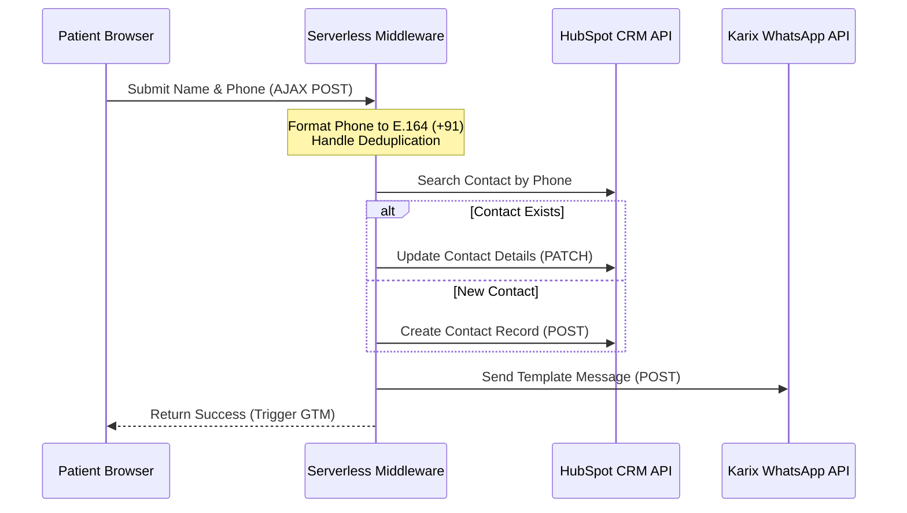

# Task 3 Solution: CRM & WhatsApp Integration Design

This document details the end-to-end integration architecture to connect OrthoNow’s landing page to HubSpot CRM and the Karix WhatsApp Business API.

---

### 1. End-to-End Architecture
To securely connect the landing page to HubSpot and Karix, we implement a server-side middleware handler (e.g., a Node.js Serverless Function). This server-side architecture protects API secrets, formats phone numbers, and handles custom data operations before sending them to the APIs.

**Workflow & The HubSpot Deduplication Trap:**
1. The client submits the validated form.
2. The middleware receives the payload and formats the phone number to the standard E.164 format (+91).
3. **The Deduplication Trap**: HubSpot natively deduplicates contacts *only* by Email, not by Phone. Since we do not collect emails, using a standard HubSpot form embed would create duplicate records for returning users. To resolve this, the middleware queries HubSpot's Search API (`POST /crm/v3/objects/contacts/search`) using the phone number as a filter.
4. If a contact exists, the middleware calls the Update API (`PATCH /crm/v3/objects/contacts/{contactId}`) to update their `firstname`, `phone`, `clinic_preference`, `source` ("Google Ads - Consultation Landing Page"), and `hs_lead_status` ("New Enquiry"). If no contact is found, the middleware calls the Create API (`POST /crm/v3/objects/contacts`) to make a new record.
5. The middleware hits the Karix WhatsApp API (`POST /v1/message/whatsapp`) to send the verification template.
6. The middleware returns a success response to the client, prompting GTM to fire the Google Ads Conversion Tag.

### 2. Single Point of Failure & Fallback
The main failure point is a third-party API timeout or outage (HubSpot or Karix). If these external calls are synchronous and fail, the patient’s lead data is lost.
*Fallback*: We implement a queue-based architecture (e.g., BullMQ with Redis, or AWS SQS). The middleware immediately writes incoming leads to a persistent database queue and returns a success response to the user. A background worker picks up jobs from the queue and executes API calls. If an API request fails (e.g., 5xx error or rate limit), the worker retries delivery up to 5 times using an exponential backoff strategy (retrying after 1 min, 5 min, 15 min, etc.). If retries are exhausted, the job moves to a Dead Letter Queue (DLQ) and fires a Slack webhook to alert the engineering team.

### 3. SLA & Delivery Monitoring (WhatsApp < 2 Min)
*Risks*: Network congestion, invalid/landline numbers, or blocked message templates can breach the 2-minute SLA.
*Monitoring*: We subscribe to Karix webhooks for message status updates (`sent`, `delivered`, `failed`). Our middleware records the form submission timestamp ($T_0$) and compares it to the incoming `delivered` webhook timestamp ($T_d$). We set up an automated script (or monitoring tool like Datadog) to alert our team via Opsgenie/Slack if $T_d - T_0 > 120$ seconds, or if the Karix delivery failure rate exceeds 2% over a rolling 10-minute window.
