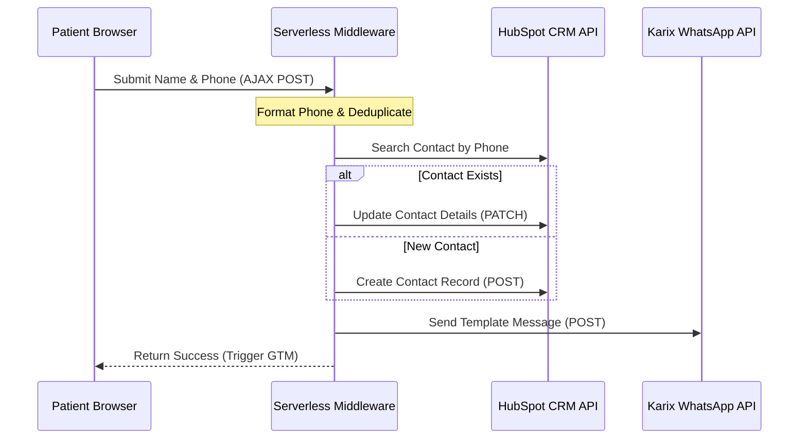

# Task 3 Solution: CRM & WhatsApp Integration Design

This document details the end-to-end integration architecture to connect OrthoNow’s landing page to HubSpot CRM and the Karix WhatsApp Business API.

---

### 1. End-to-End Architecture
We implement a serverless Node.js middleware handler to securely connect the landing page to HubSpot and Karix. This backend handler protects API credentials, formats phone numbers, and manages custom lead operations.

**Workflow & The HubSpot Deduplication Trap:**
1. The form submits. The middleware formats the phone number to E.164 (+91).
2. **The Trap**: HubSpot natively deduplicates only by Email. To prevent duplicate contacts for phone-only forms, our middleware queries HubSpot's Search API (`POST /crm/v3/objects/contacts/search`) by phone.
3. If found, the middleware updates the contact (`PATCH /crm/v3/objects/contacts/{id}`) setting Lead Status to 'New Enquiry' and Source to 'Google Ads'. Otherwise, it creates a new contact (`POST /crm/v3/objects/contacts`).
4. The middleware triggers the Karix API (`POST /v1/message/whatsapp`) and returns a success response to the browser client, prompting GTM to fire the Google Ads Conversion Tag.

### 2. Single Point of Failure & Fallback
Synchronous API failures or timeouts at HubSpot or Karix represent the primary point of failure, leading to lost leads. 
*Fallback*: We implement a persistent queue (e.g., BullMQ or AWS SQS). The middleware writes lead payloads to the queue and immediately returns a success response to the user. A background worker processes the queue, retrying failed API requests up to 5 times using exponential backoff. Failed jobs route to a Dead Letter Queue (DLQ) and trigger a Slack alert.

### 3. SLA & Delivery Monitoring (WhatsApp < 2 Min)
*Risks*: Congestion, invalid numbers, or blocked templates can breach the 2-minute SLA.
*Monitoring*: We track Karix webhooks (`sent`, `delivered`, `failed`). The middleware monitors the delta between submission ($T_0$) and delivery ($T_d$). Alerts (via Opsgenie/Slack) trigger if delivery latency ($T_d - T_0$) exceeds 120 seconds, or if failure rates exceed 2% over a rolling 10-minute window.
